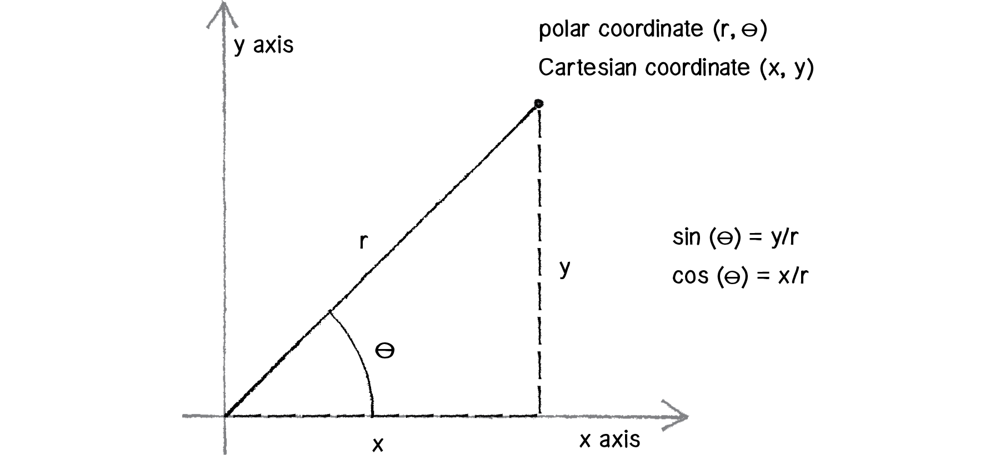

# Polar Coordinate System

The polar coordinate system is a two-dimensional coordinate system in which each point on a plane is determined by a distance(_r_-coordinate) from a reference point and an angle(_phi_-coordinate) from a reference direction.

## r-coordinate

The _r_-coordinate ,called as _radial_ coordinate, is the distance of the point from a reference point.

## phi-coordinate

The _phi_-coordinate ,called as _angular_ coordinate,is the angle from a reference direction often expresses in degrees or radians.(In `Coordinates` library _phi_ is expressed in radians.)

## Convention

The angle \phi is defined to start at 0° from a reference direction, and to increase for rotations in either counterclockwise (ccw) or clockwise (cw) orientation. In mathematics, e.g., the reference direction is usually drawn as a ray from the pole horizontally to the right, and the polar angle increases to positive angles for ccw rotations, whereas in navigation (bearing, heading) the 0°-heading is drawn vertically upwards and the angle increases for cw rotations. The polar angles decrease towards negative values for rotations in the respectively opposite orientations.

## Reference

For more information refer [this](https://en.wikipedia.org/wiki/Polar_coordinate_system).